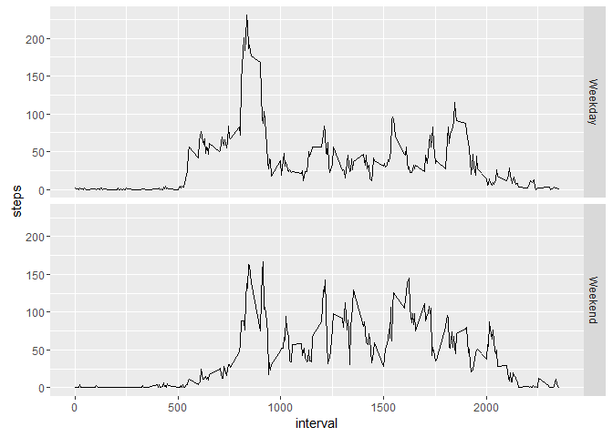

# Reproducible Research: Peer Assessment 1


## Loading and preprocessing the data


```r
activity_data<- read.csv("activity.csv", header=TRUE)
```

## What is mean total number of steps taken per day?


```r
steps_per_day<- aggregate(activity_data$steps, list(activity_data$date),FUN=sum, na.rm=TRUE)
hist(steps_per_day$x,col="blue", breaks=30)
```


```r
paste("Average steps per day=", mean(steps_per_day$x))  # note: calculated without NA
```

```
## [1] "Average steps per day= 9354.22950819672"
```

```r
paste("Median steps per day=", median(steps_per_day$x))# note: calculated without NA
```

```
## [1] "Median steps per day= 10395"
```

## What is the average daily activity pattern?

```r
steps_per_interval<- aggregate(activity_data$steps, list(activity_data$interval),FUN=mean, na.rm=TRUE)
names(steps_per_interval)<- c("Time", "Number of Steps")
plot(steps_per_interval$Time,steps_per_interval$`Number of Steps`, type = "l")
```


Below shows the time of day with the most steps on average

```r
steps_per_interval[steps_per_interval$`Number of Steps`== max(steps_per_interval$`Number of Steps`),1:2]
```

```
##     Time Number of Steps
## 104  835        206.1698
```

## Imputing missing values
There are 2304 incomplete records.
 

```r
sum(is.na(activity_data$steps))
```

```
## [1] 2304
```

The code will replace the NA values with the mean for that 5 min time period.  First binding the interval's mean to a new copy of the raw dataset.  Then it will replace all the NA's with the mean for that interval.


```r
ad_wm<- cbind(activity_data, steps_per_interval[,2])
names(ad_wm)[4]<- c("mean")
ad_wm$steps<- ifelse( is.na(ad_wm$steps),ad_wm$mean,ad_wm$steps)
```
The mean number of steps per day is shewn below and is higher than when excluding the NA's


```r
ad_wm_steps_per_day<- aggregate(ad_wm$steps, list(ad_wm$date), FUN=sum)
mean(ad_wm_steps_per_day$x)
```

```
## [1] 10766.19
```
The median number of steps per day is shewn below and is higher than when excluding the NA's

```r
median(ad_wm_steps_per_day$x)
```

```
## [1] 10766.19
```

The data show that there are much more values in the 10,000 step range now that the NA's have been replaced.

```r
steps_per_day_ad_wm<- aggregate(ad_wm$steps, list(ad_wm$date),FUN=sum)
hist(steps_per_day_ad_wm$x, col="lightblue", breaks=30, main=paste("Histogram of Total steps: data with NA replaced with mean"))
```


```r
hist(steps_per_day$x,col="blue", breaks=30)
```


## Are there differences in activity patterns between weekdays and weekends?
First the data needs to be cleaned for dates and then set a new column equal to the date's designation.

```r
ad_wm$date<- strptime(ad_wm$date, "%Y-%m-%d")
ad_wm$day<- ifelse(weekdays(ad_wm$date) %in% c("Sunday","Saturday"),"Weekend","Weekday")
names(ad_wm)
```

```
## [1] "steps"    "date"     "interval" "mean"     "day"
```

The dataset is now created with the mean for each day's interval.

```r
#ad_wm_interval_ave<- aggregate(ad_wm$steps,list(ad_wm$interval), FUN=mean)
ad_wm_we<- ad_wm[ad_wm$day=="Weekend",]
ad_wm_wd<- ad_wm[ad_wm$day=="Weekday",]
par(mfrow=c(2,1))
plot(ad_wm_wd$interval,ad_wm_wd$mean,type = "l")
plot(ad_wm_we$interval,ad_wm_we$mean,type = "l")
```




